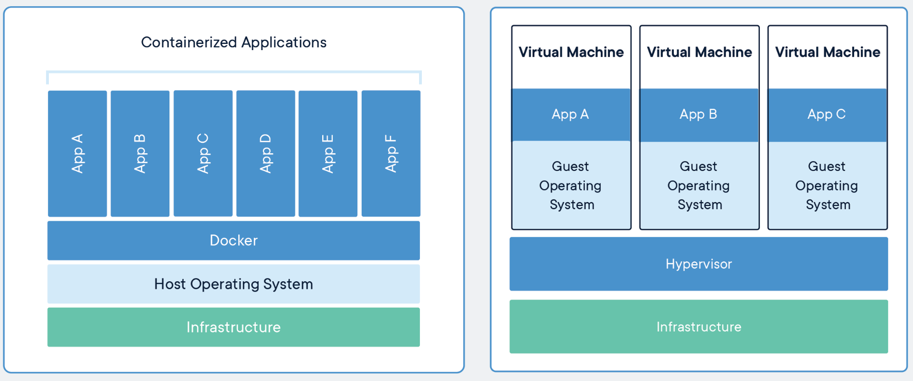
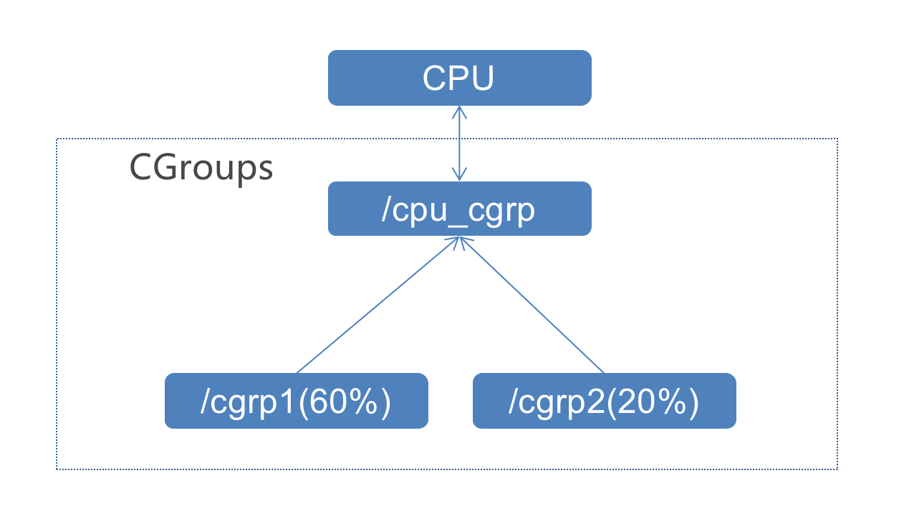

# k8s与Docker的关系

- [Docker VS 虚拟机](#Docker-VS-虚拟机)
- [Docker namespace 隔离](#Docker-namespace-隔离)
- [Docker 的资源配额 CGroups](#Docker-的资源配额-CGroups)
- [Docker 镜像](#Docker-镜像)

------

## Docker VS 虚拟机


官方解释：Package Software into Standardized Units for Development, Shipment and Deployment.

## Docker namespace 隔离

1. Docker通过 Namespace 实现进程隔离

```bash
int clone(int (*child_func)(void *), void *child_stack, int flags, void *arg);
```

2. Docker 的实现原理：Docker 如何通过 Namespace 聚合进程，实现进程间隔离。

```bash
docker run -d -p 8083:8083  nginx
ps -ef | grep docker 
ls -al /proc/[PID]/ns
```

## Docker 的资源配额 CGroups

1. Docker 使用CGroups实现资源的配额管理。

- Cgroups (control groups)
- 2007年由谷歌工程师研发
- 2008年并入 Linux Kernel 2.6.24
- C语言实现

2. CGroups 限制进程的 CPU使用时间。 Docker中的 CPU，内存，网络的限制均通过 cgroups 实现 

     

3. 实践
     在宿主机上创建一个让 CPU 飙升到100%的进程： （此操作有风险，慎用）

```bash
while : ; do : ; done &
```

记录下 PID = 27358

```bash
cd /sys/fs/cgroup/cpu
mkdir cgroups_test
echo 20000 > /sys/fs/cgroup/cpu/cgroups_test/cpu.cfs_quota_us
echo 27358 > /sys/fs/cgroup/cpu/cgroups_test/tasks
```

清理该进程 

```bash
Kill -9 27358 
```

4. docker 里如何加参数进行资源配额
     docker run -it --cpus=".5" nginx /bin/sh
     进入容器查看是否有对应的 cgroup 设置

```bash
cd /sys/fs/cgroup/cpu
cat cpu.cfs_quota_us
```

配置显示 500000，证明--cpus=".5"的参数已经生效

## Docker 镜像

1.   Docker镜像的由来

- 虽然 Docker 实现了运行环境的隔离，但如何将一个运行的容器快速进行启动，复制，迁移到其他的主机上运行？

- 如果容器无法快速进行复制，迁移，那么和以 VMware 为代表的虚拟化技术相比并没有太多优势

2.    Docker 镜像的特性

- Docker 镜像具备了应用运行所需要的所有依赖

- 一次构建，处处运行

- Docker 镜像的存储是基于 checksum 的去重存储，大大降低存储空间

3. Docker 镜像常用命令

- 下载 Docker 镜像

     ```bash
     docker pull nginx
     ```

- 为镜像打版本号

     ```bash
     docker tag 
     ```

- 上传 Docker 镜像

     ```bash
     docker push
     ```
