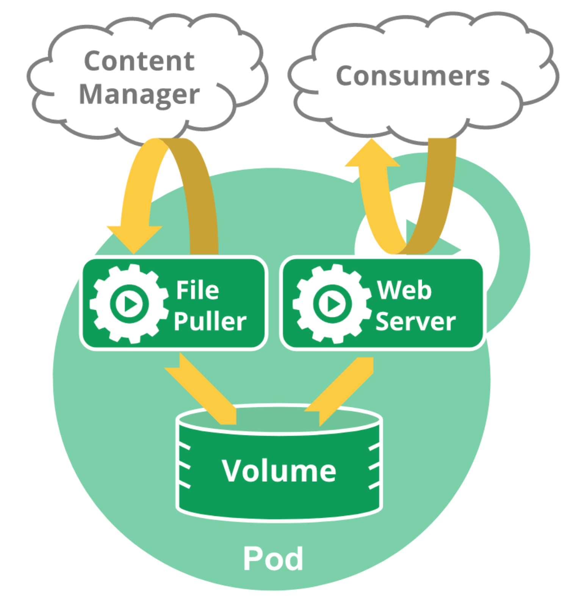

# kubernetes的调度单元Pod

## 创建第一个Pod

kubectl 创建 nginx Pod

-    编写nginx Pod 的yaml

```yaml
apiVersion: v1
kind: Pod
metadata:
  name: my-nginx
spec:
  containers:
  - image: nginx
    name: my-nginx
```

-    创建nginx Pod

```bash
kubectl apply -f nginx.yaml 
```

-    查看Pod情况

```bash
kubectl get po
kubectl describ pod my-nginx
```

## Pod实现原理

### 什么是 Pod?

Pod 的共享上下文包括一组Linux 名字空间、控制组(cgroup） 和可能一些其他的隔离方面，即用来隔离 Docker 容器的技术。在Pod的上下文中，每个独立的应用可能会进一步实施隔离。

就Docker概念的术语而言，Pod类似于共享名字空间和文件系统卷的一组 Docker 容器。

>    说明：除了Docker 之外，Kubernetes 支持很多其他容器运行时，Docker 是最有名的运行时，使用Docker的术语来描述Pod会很有帮助。

### Pod 生命期

和一个个独立的应用容器一样，Pod也被认为是相对临时性 (而不是长期存在）的实体。Pod会被创建、赋予一个唯一的ID

(UID)，并被调度到节点，并在终止 (根据重启策略）或删除之前一直运行在该节点。

如果一个节点死掉了，调度到该节点 的Pod 也被计划在预定超时期限结束后删除，

### Pod 结构图例



一个包含多个容器的 Pod 中包含一个用来拉取文件的程序和一个Web 服务器，均使用持久卷作为容器问共享的存储。

### 使用 Pod

通常你不需要直接创建 Pod，甚至单实例 Pod。相反，你会使用诸如 Deployment 或 Job这类工作负载资源来创建Pod

如果 Pod 需要跟踪状态，可以考虑 Statefulset 资源。

**Kubernetes 集群中的Pod 主要有两种用法：**

1.   运行单个容器的Pod。“每个Pod一个容器"模型是最常见的Kubernetes 用例;在这种情况下，可以将 Pod 看作单个容器的包装器，并且 Kubernetes 直接管理 Pod，而不是容器。
2.   运行多个协同工作的容器的Pod。Pod 可能封装由多个紧密耦合且需要共享资源的共处容器组成的应用程序。这些位于同一位置的容器可能形成单个内聚的服务单元，一个容器将文件从共享卷提供给公众，而另一个单独的“边车”(sidecar) 容器则刷新或更新这些文件。Pod 将这些容器和存储资源打包为一个可管理的实体。

演示：使用Job 创建一个Pod，打印信息后会暂停。

```yaml
apiVersion: batch/v1
kind: Job
metadata:
  name: hello
spec:
  completions: 5
  template:
    # 这里是 Pod 模版
    spec:
      containers:
      - name: hello
        image: nginx
        command: ['sh', '-c', 'echo "Hello, Kubernetes! " && sleep 2']
      restartPolicy: OnFailure
    # 以上为 Pod 模版
```

### Pod 网络

每个Pod 都在每个地址族中获得一个唯一的 IP 地址。Pod 中的每个容器共享网络名字空间，包括 IP 地址和网络端口。Pod

内的容器可以使用 localhost 互相通信。当Pod 中的容器与 Pod 之外 的实体通信时，它们必须协调如何使用共享的网络资

源（例如端口）。

## Pod的生命周期

### 容器阶段 Phase

1.   Pending (挂起）Pod 已被 Kubernetes 系统接受，但有一个或者多个容器尚末创建亦末运行。此阶段包括等待 Pod 被调度的时间和通过网络下载镜像的时间。
2.   Running (运行中） Pod 已经绑定到了某个节点，Pod 中所有的容器都已被创建。至少有一个容器仍在运行，或者正处于启动或重启状态。
3.   Succeeded (成功）Pod 中的所有容器都已成功终止，并且不会再重启。
4.   Failed （失败） Pod 中的所有容器都已終止，并且至少有一个容器是因为失败终止。也就是说，容器以非0状态退出或者被系统终止。
5.   Unknown（未知）因为某些原因无法取得 Pod 的状态。这种情况通常是因为与 Pod 所在主机通信失败。

### 容器状态 Status

 一旦调度器将 Pod 分派给某个节点，kubelet 就通过容器运行时开始为Pod创建容器。容器的状态有三种：Waiting（等待）、Running（运行中）和 Terminated （已终止）`kubectl describe pod <pod 名称>`

1.   Waiting （等待）如果容器并不处在 Running 或 Terminated 状态之一，它就处在 Waiting 状态。处于 Waiting 状态的容器仍在运行它完成启动所需要的操作：例如，从某个容器镜像仓库拉取容器镜像，或者向容器应用 Secret 数据等等。当你使用 kubectl 来查询包含Waiting 状态的容器的 Pod 时，你也会看到一个 Reason 字段，其中给出了容器处于等待状态的原因。
2.    Running（运行中）Running 状态表明容器正在执行状态并且没有问题发生。如果配置了 postStart 回调，那么该回调已经执行完成。如果你使用kubectl 来查询包含 Running 状态的容器的 Pod 时，你也会看到关于容器进入 Running 状态的信息。
3.    Terminated （已终止)  处于 Terminated 状态的容器已经开始执行并且或者正常结束或者因为某些原因失败。如果你使用 kubectl 来查询包含Terminated 状态的容器的 Pod 时，你会看到容器进入此状态的原因、退出代码以及容器执行期间的起止时间。

## 为容器的生命周期事件设置处理函数

定义 postStart 和 preStop 处理函数, 创建一个包含一个容器的 Pod，该容器为 postStart 和 preStop 事件提供对应的处理函数。

```yaml
apiVersion: v1
kind: Pod
metadata:
  name: lifecycle-demo
spec:
  containers:
  - name: lifecycle-demo-container
    image: nginx
    lifecycle:
      postStart:
        exec:
          command: ["/bin/sh", "-c", "echo Hello from the postStart handler > /usr/share/message"]
      preStop:
        exec:
          command: ["/bin/sh","-c","nginx -s quit; while killall -0 nginx; do sleep 1; done"]
```

在上述配置文件中，可以看到 postStart 命令在容器的/usr/share 目录下写入文件message。命令prestop 负责优雅地终止nginx 服务。当因为失效而导致容器终止时，这一处理方式很有用。

-    创建 Pod

```bash
kubectl apply -f kubeblog/docs/Chapter6/lifecycle-events.yaml
```

-    验证Pod中的容器已经运行

```bash
kubectl get pod lifecycle-demo
```

-    使用shell链接到你的Pod里的容器

```bash
kubectl exec -it lifecycle-demo -- /bin/bash
```

-    在shell中，验证postStart处理函数创建了message文件

```bash
root@lifecycle-demo:/# cat /usr/share/message
```

-    命令行输出的是postStart 处理函数所写入的文本

```bash
Hello from the postStart handler
```

## 创建包含Init容器的 Pod

-    理解 Init 容器

     每个 Pod 中可以包含多个容器，应用运行在这些容器里面，同时 Pod 也可以有一个或多个先于应用容器启动的 Init 容器。

lnit 容器与普通的容器非常像，除了如下两点：

1.   它们总是运行到完成。
2.   每个都必须在下一个启动之前成功完成。如果Pod的 Init 容器失败，Kubernetes 会不断地重启该Pod，直到 Init 容器成功为止。然而，如果Pod 对应的restartPolicy 值为 Never, Kubernetes 不会重新启动Pod。与普通容器的不同之处, lnit 容器支持应用容器的全部属性和特性，包括资源限制、数据卷和安全设置。同时 Init 容器不支持 lifecycle、livenessProbe、readinessProbe 和 startupProbe，因为它们必须在 Pod 就绪之前运行完成。

实战 lnit Pod

下面的例子定义了一个具有2个Init 容器的简单 Pod。第一个等待myservice 启动，第二个等待mydb 启动。一旦这两个Init容器 都启动完成，Pod 将启动spec 节中的应用容器。

```yaml
apiVersion: v1
kind: Pod
metadata:
  name: myapp-pod
  labels:
    app: myapp
spec:
  containers:
  - name: myapp-container
    image: busybox:1.28
    command: ['sh', '-c', 'date && sleep 3600']
  initContainers:
  - name: init-container
    image: busybox:1.28
    command: ['sh', '-c', "date && sleep 10"]
```

-    要启动这个Pod，可以执行如下命令

```bash
kubectl apply -f kubeblog/docs/Chapter5/myapp.yaml
```

-    如需查看Pod内Init容器的日志，请执行：

```bash
kubectl logs myapp-pod -c init-container      # 查看第二个 Init 容器
```

此时，Init容器将会等待10秒，你将能看到Init容器执行完毕，随后my-app的Pod进入Running状态：

```bash
$ kubectl get -f myapp.yaml
NAME        READY     STATUS    RESTARTS   AGE
myapp-pod   1/1       Running   0          9m
```

我们能够看到Init容器完成，并且myapp-pod被创建

## 用探针检查 Pod 的健康性

### 探针的作用

探针是由 kubelet 对容器执行的定期诊断。要执行诊断，kubelet 调用由容器实现的 Handler （处理程序）。有三种类型的处理程序：

ExecAction：在容器内执行指定命令。如果命令退出时返回码为0则认为诊断成功。

TCPSocketAction：对容器的IP地址上的指定端口执行 TCP 检查。如果端口打开，则诊断被认为是成功的。

HTTPGetAction：对容器的 1P 地址上指定端口和路径执行 HTTP Get 请求。如果响应的状态码大于等于200 且小于 400，则诊断被认为是成功的。

每次探测都将获得以下三种结果之一：

-    Success（成功）：容器通过了诊断。
-    Failure（失败）：容器末通过诊断。
-    Unknown（未知）：诊断失败，因此不会采取任何行动。

### 何时该使用启动探针？

对于所包含的容器需要较长时间才能启动就绪的 Pod 而言，启动探针是有用的。你不再需要配置一个较长的存活态探测时间间隔，只需要设置另一个独立的配置选定，对启动期间的容器执行探测，从而允许使用远远超出存活态时间间隔所允许的时长。

如果你的容器启动时间通常超出 initialDelay Seconds + failure Threshold x periodSeconds 总值，你应该设置一个启动探测，对存活态探针所使用的同一端点执行检查。periodSeconds 的默认值是 30 秒。你应该将其 failureThreshold 设置得足够高，以便容器有充足的时间完成启动，并且避免更改存活态探针所使用的默认值。这一设置有助于减少死锁状况的发生。

### 实现http请求探针

```yaml
apiVersion: v1
kind: Pod
metadata:
  labels:
    test: liveness
  name: liveness-http
spec:
  containers:
  - name: liveness
    image: mirrorgooglecontainers/liveness
    args:
    - /server
    livenessProbe:
      httpGet:
        path: /healthz
        port: 8080
        httpHeaders:
        - name: Custom-Header
          value: Awesome
      initialDelaySeconds: 3
      periodSeconds: 3
```

在这个配置文件中，可以看到 Pod 也只有一个容器。 periodseconds 字段指定了kubelet 每隔3秒执行一次存活探测。initialDelayseconds 字段告诉 kubelet 在执行第一次探测前应该等待3秒。kubelet 会向容器内运行的服务 （服务会监听 8080 端口）发送一个 HTTP GET 请求来执行探测。如果服务器上 /healthz 路径下的处理程序返回成功代码，则kubelet 认为容器是健康存活的。如果处理程序返回失败代码，则kubelet 会杀死这个容器并且重新启动它。

任何大于或等于 200 并且小于 400 的返回代码标示成功，其它返回代码都标示失败。

可以在这里看服务的源码 server.go

容器存活的最开始 10 秒中，/healthz 处理程序返回一个 200 的状态码。之后处理程序返回 500 的状态码。

```go
http.HandleFunc("/healthz", func(w http.ResponseWriter, r *http.Request) {
    duration := time.Now().Sub(started)
    if duration.Seconds() > 10 {
        w.WriteHeader(500)
        w.Write([]byte(fmt.Sprintf("error: %v", duration.Seconds())))
    } else {
        w.WriteHeader(200)
        w.Write([]byte("ok"))
    }
})
```

kubelet 在容器启动之后3秒开始执行健康检测。所以前几次健康检查都是成功的。但是 10秒之后，健康检查会失败，并且

kubelet 会杀死容器再重新启动容器。

创建一个 Pod 来测试 HTTP 的存活检测：

```bash
kubectl apply -f https://k8s.io/examples/pods/probe/http-liveness.yaml
```

10秒之后，通过看 Pod 事件来检测存活探测器已经失败了并且容器被重新启动了。

```bash
kubectl describe pod liveness-http
```

## 为容器设置启动时要执行的命令和参数

### 创建 Pod 时设置命令及参数

创建Pod 时，可以为其下的容器设置启动时要执行的命令及其参数。如果要设置命令，就填写在配置文件的command 字段下，如果要设置命令的参数，就填写在配置文件的 args 字段下。一旦Pod 创建完成，该命令及其参数就无法再进行更改了。

如果在配置文件中设置了容器启动时要执行的命令及其参数，那么容器镜像中自带的命令与参数将会被覆盖而不再执行。如果配置文件中只是设置了参数，却没有设置其对应的命令，那么容器镜像中自带的命令会使用该新参数作为其执行时的参数。

>    说明：在有些容器运行时中，command 字段对应 entrypoint

本示例中，将创建一个只包含单个容器的Pod。在Pod 配置文件中设置了一个命令与两个参数：

```yaml
apiVersion: v1
kind: Pod
metadata:
  name: command-demo
  labels:
    purpose: demonstrate-command
spec:
  containers:
  - name: command-demo-container
    image: debian
    command: ["printenv"]
    args: ["HOSTNAME", "KUBERNETES_PORT"]
  restartPolicy: OnFailure
```

基于 YAML 文件创建一个 Pod:

```yaml
kubectl apply -f kubeblog/docs/Chapter5/commands.yaml
```

获取正在运行的 Pods:

```bash
kubectl get pods
```

查询结果显示在 command-demo 这个Pod 下运行的容器已经启动完成。

如果要获取容器启动时执行命令的输出结果，可以通过 Pod 的日志进行查看：

```bash
kubectl logs command-demo
```

日志中显示了 HOSTNAME 与 KUBERNETES_ PORT 这两个环境变量的值：

```bash
command-demo
tcp://10.3.240.1:443
```

### 使用环境变量来设置参数

在上面的示例中，我们直接将一串字符作为命令的参数。除此之外，我们还可以将环境变量作为命令的参数。

```bash
env:
- name: MESSAGE
  value: "hello world"
command: ["/bin/echo"]
args: ["$(MESSAGE)"]
```

这意味着你可以将那些用来设置环境变量的方法应用于设置命令的参数，其中包括了 ConfigMlaps与 Secrets

>    说明：环境变量需要加上括号，类似于 “＄(VAR）”。这是在command 或 args 字段使用变量的格式要求。

## 为容器定义相互依赖的环境变量

当创建一个 Pod 时，你可以为运行在 Pod 中的容器设置相互依赖的环境变量。 设置相互依赖的环境变量，你就可以在配置清单文件的  `env`  的  `value`  中使用 $(VAR_NAME)。

创建一个单容器的 Pod。 此 Pod 的配置文件定义了一个已定义常用用法的相互依赖的环境变量。 下面是 Pod 的配置清单：


```yaml
apiVersion: v1
kind: Pod
metadata:
  name: dependent-envars-demo
spec:
  containers:
    - name: dependent-envars-demo
      args:
        - while true; do echo -en '\n'; printf UNCHANGED_REFERENCE=$UNCHANGED_REFERENCE'\n'; printf SERVICE_ADDRESS=$SERVICE_ADDRESS'\n';printf ESCAPED_REFERENCE=$ESCAPED_REFERENCE'\n'; sleep 30; done;
      command:
        - sh
        - -c
      image: busybox
      env:
        - name: SERVICE_PORT
          value: "80"
        - name: SERVICE_IP
          value: "172.17.0.1"
        - name: UNCHANGED_REFERENCE
          value: "$(PROTOCOL)://$(SERVICE_IP):$(SERVICE_PORT)"
        - name: PROTOCOL
          value: "https"
        - name: SERVICE_ADDRESS
          value: "$(PROTOCOL)://$(SERVICE_IP):$(SERVICE_PORT)"
        - name: ESCAPED_REFERENCE
          value: "$$(PROTOCOL)://$(SERVICE_IP):$(SERVICE_PORT)"

```

1.  依据清单创建 Pod：

      ```shell
     kubectl apply -f https://k8s.io/examples/pods/inject/dependent-envars.yaml
      ```

      ```bash
     pod/dependent-envars-demo created
      ```

2.  列出运行的 Pod：

      ```shell
     kubectl get pods dependent-envars-demo
      ```

      ```bash
     NAME                      READY     STATUS    RESTARTS   AGE
     dependent-envars-demo     1/1       Running   0          9s
      ```

3.  检查 Pod 中运行容器的日志：

      ```shell
     kubectl logs pod/dependent-envars-demo
      ```

      ```
     UNCHANGED_REFERENCE=$(PROTOCOL)://172.17.0.1:80
     SERVICE_ADDRESS=https://172.17.0.1:80
     ESCAPED_REFERENCE=$(PROTOCOL)://172.17.0.1:80
      ```

如上所示，你已经定义了  `SERVICE_ADDRESS`  的正确依赖引用，  `UNCHANGED_REFERENCE`  的错误依赖引用， 并跳过了  `ESCAPED_REFERENCE`  的依赖引用。

如果环境变量被引用时已事先定义，则引用可以正确解析， 比如  `SERVICE_ADDRESS`  的例子。

当环境变量未定义或仅包含部分变量时，未定义的变量会被当做普通字符串对待， 比如  `UNCHANGED_REFERENCE`  的例子。 注意，解析不正确的环境变量通常不会阻止容器启动。

`$(VAR_NAME)`  这样的语法可以用两个  `$`  转义，既：`$$(VAR_NAME)`。 无论引用的变量是否定义，转义的引用永远不会展开。 这一点可以从上面  `ESCAPED_REFERENCE`  的例子得到印证。

**dependent-envars**

```yaml
apiVersion: v1
kind: Pod
metadata:
  name: dependent-envars-demo
spec:
  containers:
    - name: dependent-envars-demo
      args:
        - while true; do echo -en '\n'; printf UNCHANGED_REFERENCE=$UNCHANGED_REFERENCE'\n'; printf SERVICE_ADDRESS=$SERVICE_ADDRESS'\n';printf ESCAPED_REFERENCE=$ESCAPED_REFERENCE'\n'; sleep 30; done;
      command:
        - sh
        - -c
      image: busybox
      env:
        - name: SERVICE_PORT
          value: "80"
        - name: SERVICE_IP
          value: "172.17.0.1"
        - name: UNCHANGED_REFERENCE
          value: "$(PROTOCOL)://$(SERVICE_IP):$(SERVICE_PORT)"
        - name: PROTOCOL
          value: "https"
        - name: SERVICE_ADDRESS
          value: "$(PROTOCOL)://$(SERVICE_IP):$(SERVICE_PORT)"
        - name: ESCAPED_REFERENCE
          value: "$$(PROTOCOL)://$(SERVICE_IP):$(SERVICE_PORT)"
```

## 为容器和 Pods 分配 CPU 资源

### 创建一个命名空间

创建一个命名空间，以便将 本练习中创建的资源与集群的其余部分资源隔离。

```bash
kubectl create namespace cpu-example
```

### 指定 CPU 请求和 CPU 限制

要为容器指定 CPU 请求，请在容器资源清单中包含 resources：requests 字段。要指定 CPU 限制，请包含 resources: Limits。

在本练习中，你将创建一个具有一个容器的 Pod。容器将会请求 0.5 个 CPU，而且最多限制使用1个CPU。这是Pod 的配置文件 cpu-request-1imit.yaml：

```yaml
apiVersion: v1
kind: Pod
metadata:
  name: cpu-demo
  namespace: cpu-example
spec:
  containers:
  - name: cpu-demo-ctr
    image: nginx
    resources:
      limits:
        cpu: "1"
      requests:
        cpu: "0.5"
    args:
    - -cpus
    - "2"
```

配置文件的 args 部分提供了容器启动时的参数。-cpus "2〞参数告诉容器尝试使用2个 CPU。

创建 Pod:

```bash
kubectl apply -f cpu-request-limit.yaml --namespace=cpu-example
```

验证所创建的 Pod 处于 Running 状态

```bash
kubectl get pod cpu-demo --namespace=cpu-example
```

杳看見示关千 pod 的详细信息：

```bash
kubectl get pod cpu-demo --output=yaml --namespace=cpu-example
```

输出显示 Pod 中的一个容器的 CPU 请求为 500 milli CPU，并且 CPU 限制为 1个CPU.

```bash
resources:
  limits:
    cpu: "1"
  requests:
    cpu: 500m
```

## 用节点亲和性把 Pods 分配到节点

在 Kubernetes 集群中，如何使用节点亲和性把 Kubernetes Pod 分配到特定节点。

### 给节点添加标签

列出集群中的节点及其标签：

```bash
kubectl get nodes --show-labels
```

输出类似于此：

```bash
NAME      STATUS    ROLES    AGE     VERSION        LABELS
worker0   Ready     <none>   1d      v1.13.0        ...,kubernetes.io/hostname=worker0
worker1   Ready     <none>   1d      v1.13.0        ...,kubernetes.io/hostname=worker1
worker2   Ready     <none>   1d      v1.13.0        ...,kubernetes.io/hostname=worker2
```

选择一个节点，给它添加一个标签：

```bash
kubectl label nodes <your-node-name> disktype=ssd
```

其中 <your-node-name> 是你所选节点的名称。

验证你所选节点具有 disktype=ssd 标签：

```bash
kubectl get nodes --show-labels
```

输出类似于此：

```bash
NAME      STATUS    ROLES    AGE     VERSION        LABELS
worker0   Ready     <none>   1d      v1.13.0        ...,disktype=ssd,kubernetes.io/hostname=worker0
worker1   Ready     <none>   1d      v1.13.0        ...,kubernetes.io/hostname=worker1
worker2   Ready     <none>   1d      v1.13.0        ...,kubernetes.io/hostname=worker2
```

在前面的输出中，可以看到 worker0 节点有一个disktype=ssd 标签。

### 依据强制的节点亲和性调度 Pod

下面清单描述了一个 Pod，它有一个节点亲和性配置 requiredDuringscheduling Igno redDuringExecution, disktype=

ssd。这意味着 pod 只会被调度到具有 disktype=ssd 标签的节点上。

```yaml
apiVersion: v1
kind: Pod
metadata:
  name: nginx
spec:
  affinity:
    nodeAffinity:
      requiredDuringSchedulingIgnoredDuringExecution:
        nodeSelectorTerms:
        - matchExpressions:
          - key: disktype
            operator: In
            values:
            - ssd            
  containers:
  - name: nginx
    image: nginx
    imagePullPolicy: IfNotPresent
```

执行 （Apply）此清单来创建一个调度到所选节点上的 Pod：

```bash
kubectl apply -f https://k8s.io/examples/pods/pod-nginx-required-affinity.yaml
```

验证pod 己经在所选节点上运行：

```bash
kubectl get pods --output=wide
```

输出类似于此：

```bash
NAME     READY     STATUS    RESTARTS   AGE    IP           NODE
nginx    1/1       Running   0          13s    10.200.0.4   worker0
```

## 将 ConfigMap 中的键值对配置为容器环境变量

创建一个包含多个键值对的 ContigMap。以下是：contigmap-multikeys.yaml

```yaml
apiVersion: v1
kind: ConfigMap
metadata:
  name: special-config
  namespace: default
data:
  SPECIAL_LEVEL: very
  SPECIAL_TYPE: charm
```

创建 Contig Map:

```bash
kubectl create -f configmap-multikeys.yaml
```

使用 envFrom 将所有 ContigMap 的数据定义为容器环境变量，ConfigMap 中的键成为 Pod 中的环境变量名称。创建文

件：pod-configmap-envFrom.yaml

```yaml
apiVersion: v1
kind: Pod
metadata:
  name: dapi-test-pod
spec:
  containers:
    - name: test-container
      image: k8s.gcr.io/busybox
      command: [ "/bin/sh", "-c", "env" ]
      envFrom:
      - configMapRef:
          name: special-config
  restartPolicy: Never
```

创建 Pod:

```bash
kubectl create -f pod-configmap-envFrom.yaml
```

Pod 的输出包含环境变量 SPECIAL_LEVEL=very 和 SPECIAL_TYPE=charm。

## 容器root 用户 VS privileged

### 以Root用户运行

Docker允许隔离其主机os上的进程，功能和文件系统，并且出于实际原因，大多数容器默认实际上以root用户身份运行。

```bash
$ docker run -it busybox sh
# whoami
root # Notice here, we are still root!
# id -u
0
# hostname
382f1c400bd
# sysctl kernel.hostname=Attacker
sysctl: setting key "kernel.hostname": Read-only file system  # Yet we can't do this
```

启用 privileged

```bash
$ docker run -it --privileged busybox sh
# whoami
root. # Root again
# id -u
0
# hostname
86c62e9bba5e
# sysctl kernel.hostname=Attacker
kernel.hostname = Attacker # Except now we are privileged
# hostname
Attacker 
```

Kubernetes通过Security Context提供了相同的功能：

```yaml
apiVersion: v1
kind: Pod
metadata:
  name: nginx
spec:
  containers:
  - name: nginx
    image: nginx
    securityContext:
      privileged: true
```

## 为 pod 创建非root 用户运行

要为 Pod 设置安全性设置，可在Pod 规约中包含securitycontext 宇段。securitycontext 字段值是一个PodSecurityContex] 对象。你为 Pod 所设置的安全性配置会应用到 Pod 中所有 Container 上。下面是一个Pod 的配置文件，该Pod 定义了 securitycontext 和一个emptyDir 卷。创建security-context.yaml）

```yaml
apiVersion: v1
kind: Pod
metadata:
  name: security-context-demo
spec:
  securityContext:
    runAsUser: 1000
    runAsGroup: 3000
    fsGroup: 2000
  volumes:
  - name: sec-ctx-vol
    emptyDir: {}
  containers:
  - name: sec-ctx-demo
    image: busybox
    command: [ "sh", "-c", "sleep 1h" ]
    volumeMounts:
    - name: sec-ctx-vol
      mountPath: /data/demo
    securityContext:
      allowPrivilegeEscalation: false
```

在配置文件中，runAsUser 字段指定Pod 中的所有容器内的进程都使用用户 1D 1000 来运行。runAsGroup 字段指定所有容器中的进程都以主组 10 3000 来运行。如果忽路此字段，则容器的主组1D将是root (0）。当runASGroup 被设置时，所有创建的文件也会划日用户 1000 和组3000。由于 fsGroup 被设置，容器中所有进程也会是附组 1D 2000 的一部分。卷/data/dem。及在该卷中创建的任何文件的厲主都会是组 1D 2000。

创建该 Pod:

```yaml
kubectl apply -f security-context.yaml
```

检查Pod 的容器处于运行状态：

```bash
kubectl get pod security-context-demo
```

开启一个 Shell 进入到运行中的容器：

```bash
kubectl exec -it security-context-demo -- sh
```

在你的 Shell 中，列举运行中的进程：

```bash
ps
```

## 字段选择器

字段选择器(Field selectors） 允许你根据一个或多个资源字段的值 筛选 Kubernetes 资源。下面是一些使用字段选择器查询的

例子：

```yaml
metadata.name=my-service
metadata.namespace!=default
status.phase=Pending
```

下面这个kubectl 命令将筛选出 status.phase 字段值为 Running 的所有Pod:

```bash
kubectl get pods --field-selector status.phase=Running
```

说明：

宇段选择器本质上是资源过滤器 (Filters)。默认情况下，字段选择器/过滤器是未被应用的， 这意味着指定类型的所有资源都会被筛选出来。这使得以下的两个 kubectl 查询是等价的：

```bash
kubectl get pods
kubectl get pods --field-selector ""
```

支持的字段

不同的Kubernetes 资源类型支持不同的字段选择器。所有资源类型都支持 metadata.name 和metadata.namespace 字段。使用不被支持的字段选择器会产生错误。例如：

```bash
kubectl get ingress --field-selector foo.bar=baz
```

支持的操作符

你可在字段选择器中使用=、==和!=（=和==的意义是相同的）操作符。例如，下面这个kubectl 命令将筛选所有不属于default 命名空间的 Kubernetes 服务：

```bash
kubectl get services  --all-namespaces --field-selector metadata.namespace!=default
```

链式选择器

同标签和其他选择器一样，字段选择器可以通过使用逗号分隔的列表组成一个选择链。下面这个 kubectl 命令将筛选status.phase 字段不等于 Running 同时 spec.restartPolicy 字段等于 Always 的所有Pod:

```bash
kubectl get pods --field-selector=status.phase!=Running,spec.restartPolicy=Always
```

多种资源类型

你能够跨多种资源类型来使用字段选择器。下面这个kubect! 命令将筛选出所有不在 default 命名空间中的 Statefulset 和Service:

```bash
kubectl get statefulsets, services --all-namespaces --field-selector metadata.namespace!=default
```

