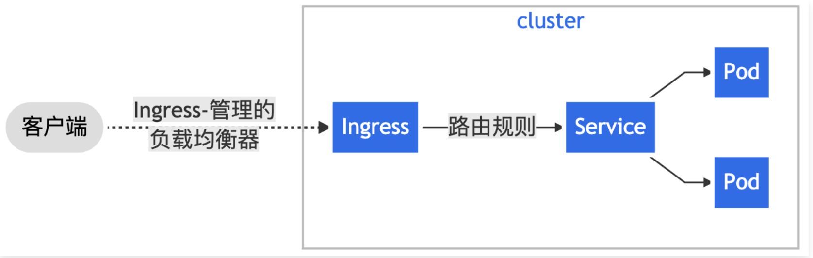
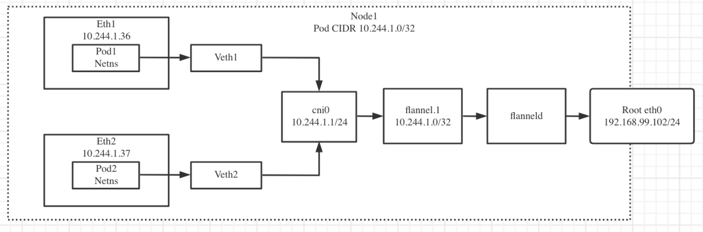
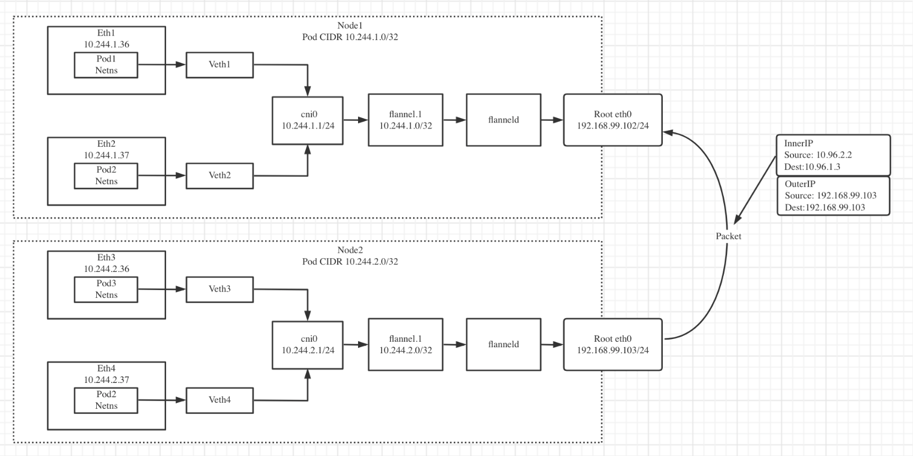

# kubernetes的网络实现及原理

- [Service对象介绍及实践](#Service对象介绍及实践)
  - [为什么需要Service](#为什么需要Service)
  - [Service定义](#Service定义)
  - [定义Service](#定义Service)
- [集群内部访问Pod](#集群内部访问Pod)
  - [在集群中暴露Pod](#在集群中暴露Pod)
  - [创建Service](#创建Service)
- [集群内Pod通信机制](#集群内Pod通信机制)
- [实践Service创建DNS记录从集群外部访问Service](#实践Service创建DNS记录从集群外部访问Service)
  - [从集群外部访问Service的方法](#从集群外部访问Service的方法)
  - [实战从集群外部访问Service](#实战从集群外部访问Service)
- [Ingress介绍和安装](#Ingress介绍和安装)
  - [Ingress](#Ingress)
  - [环境准备](#环境准备)
    - [Ingress资源](#Ingress资源)
    - [Ingress规则](#Ingress规则)
  - [安装Nginx Ingress控制器](#安装Nginx-Ingress控制器)
    - [ngress控制器](#ngress控制器)
- [解析Pod网络通信机制](#解析Pod网络通信机制)
  - [同主机Pod网络通信](#同主机Pod网络通信)
  - [跨主机Pod通信机制](#跨主机Pod通信机制)

------

## Service对象介绍及实践

### 为什么需要Service

每个Pod 都有自己的IP地址，但是在 Deployment 中，在同一时刻运行的 Pod 集合可能与稍后运行该应用程序的Pod 集合不同。

这导致了一个问题：如果一组Pod（称为“后端”） 为群集内的其他 Pod（称为“前端”） 提供功能，那么前端如何找出并跟踪

要连接的 IP 地址，以便前端可以使用后端部分？

### Service定义

将运行在一组 Pods 上的应用程序公开为网络服务的抽象方法。使用 Kubernetes 服务无需修改应用程序即可使用通用的服务发现机制。 Kubernetes 为 Pods 提供自己的 IP地址，并为一组Pod 提供相同的 DNS 名，并且可以在它们之问进行负载均衡。

### 定义Service

Service 在Kubernetes 中是一个REST 对象，和Pod 类似。像所有的 REST对象一样，Service 定义可以基于 POST方式，请求 API server 创建新的实例。

例如，假定有一组 Pod，它们对外暴露了 9376 端口，同时还被打上 app=MyApD 标签

```bash
apiVersion: v1
kind: Service
metadata:
  name: my-service
spec:
  selector:
    app: MyApp
  ports:
    - protocol: TCP
      port: 80
      targetPort: 9376
```

上述配置创建一个名称为“my-service” 的 Service 对象，它会将请求代理到使用TCP 端口 9376，并且具有标签“app=MyApp"的 Pod 上。Kubernetes 为该服务分配一个IP地址（有时称为 “集群IP，该IP地址由服务代理使用。

>    说明：需要注意的是，Service 能够将一个接收 port 映射到任意的targetPort。默认情况下，targetPort 将被设置为与
>
>    port 宇段相同的值。

## 集群内部访问Pod

### 在集群中暴露Pod

创建一个 Nginx Pod，声明它具有一个容器端口80：

```bash
apiVersion: apps/v1
kind: Deployment
metadata:
  name: my-nginx
spec:
  selector:
    matchLabels:
      run: my-nginx
  replicas: 2
  template:
    metadata:
      labels:
        run: my-nginx
    spec:
      containers:
      - name: my-nginx
        image: registry.cn-beijing.aliyuncs.com/qingfeng666/nginx:latest
        ports:
        - containerPort: 80
```

这使得可以从集群中任何一个节点来访问它。检查节点，该Pod 正在运行：

```bash
kubectl apply -f ./run-my-nginx.yaml
kubectl get pods -l run=my-nginx -o wide

NAME                        READY     STATUS    RESTARTS   AGE       IP            NODE
my-nginx-3800858182-jr4a2   1/1       Running   0          13s       10.244.3.4    kubernetes-minion-905m
my-nginx-3800858182-kna2y   1/1       Running   0          13s       10.244.2.5    kubernetes-minion-ljyd
```

检杳Pod的IP地址：

```bash
kubectl get pods -1 run=my-nginx -o yaml | grep podIP

podIP: 10.244.3.4
podIP: 10.244.2.5
```

此时能够通过 ssh 登录到集群中的任何一个节点上，使用curl 也能调通所有 IP 地址。需要注意的是，容器不会使用该节点上的

80 端口，也不会使用任何特定的 NAT 规则去路由流量到Pod 上。这意味着可以在同一个节点上运行多个 Pod，使用相同的容器

端口，并且可以从集群中任何其他的 Pod 或节点上使用 IP 的方式访问到它们。

### 创建Service

Kubernetes Service 从逻辑上定义了运行在集群中的一组 Pod，这些 Pod 提供了相同的功能。 当每个 service 创建时，会被分配一个唯一的P地址（也称为 clusterlP）。这个P地址与一个 Service 的生命周期鄉定在一起，当 Service 存在的时候它也不会改变。可以配置 Pod 使它与 Service 进行通信，Pod 知道与 Service 通信将被自动地负载均衡到该 Service 中的某些 Pod 上：

可以使用 kubectl expose 命令为 2个 Nginx 副本创建一个 Service:

```bash
kubectl expose deployment/my-nginx service/my-nginx exposed
```

这等价于使用`kubectl create -f`命令创建，对应如下的yaml文件：

nginx-svc.yaml

```yaml
apiVersion: v1
kind: Service
metadata:
  name: my-nginx
  labels:
    run: my-nginx
spec:
  ports:
  - port: 80
    protocol: TCP
  selector:
    run: my-nginx
```

上述规约将创建一个 Service，对应具有标签run：my-nginx 的Pod，目标TCP 端口 80，并且在一个抽象的 Service 端口（targetPort ：容器接收流量的端口;port ：抽象的 Service 端口，可以使任何其它 Pod 访问该 Service 的端口）上暴露。查看你的 Service 资源：

```bash
kubectl get svc my-nginx

NAME       TYPE        CLUSTER-IP     EXTERNAL-IP   PORT(S)   AGE
my-nginx   ClusterIP   10.0.162.149   <none>        80/TCP    21s
```

正如前面所提到的，一个Service 由一组backend Pod 组成。这些 Pod 通过 endpoints 暴露出来。Service Selector 将持续观察，结果被 POST 到一个名称为 my-nginx 的Endpoint 对象上。当Pod 终止后，它会自动从 Endpoint 中移除，新的能够匹配上 Service Selector 的Pod 将自动地被添加到 Endpoint 中。检查该Endpoint， 注意到 IP 地址与在第一步创建的 Pod 是相同的。

```bash
kubectl describe svc my-nginx

Name:                my-nginx
Namespace:           default
Labels:              run=my-nginx
Annotations:         <none>
Selector:            run=my-nginx
Type:                ClusterIP
IP:                  10.0.162.149
Port:                <unset> 80/TCP
Endpoints:           10.244.2.5:80,10.244.3.4:80
Session Affinity:    None
Events:              <none>
```

```bash
kubectl get ep my-nginx

NAME       ENDPOINTS                     AGE
my-nginx   10.244.2.5:80,10.244.3.4:80   1m
```

现在，能够从集群中的worker节点上使用curl 命令请求 Nginx Service =CLUSTER-IP>:<PORT＞。注意 Service IP 完全是虛拟的，它从来没有走过网络。

## 集群内Pod通信机制

Kubernetes 支持两种基本的服务发现模式 一一环境变量和 DNS。

-    环境变量

     当Pod 运行在Node 上，kubelet 会为每个活跃的 Service 添加一组环境变量。它同时支持 Docker links、简单的SVCNAME)_ SERVICE_ HOST 和{SVCNAME)_SERVICE_ PORT 变量。这里 Service 的名称需大写，横线被转换成下划线。

     举个例子，一个名称为“my-nginx”的 Service 暴露了 TCP 端口 80，同时给它分配了Cluster IP 地址 10.1.180.155，这个

     Service 生成了如下环境变量：

```bash
MY NGINX PORT 80 TCP PORT=80
MY_NGINX_PORT_80_TCP_PROTO=tc
MY_NGINX_PORT_80_TCP_ADDR=10.1.180.155
```

>    说明：
>
>    当您具有需要访问服务的Pod时，并且您正在使用环境变量方法将端口和群集 1P 发布到客户端 Pod 时，必须在客户端 Pod出现 之前创建服务。否则，这些客户端 Pod 将不会设定其环境变量。

-    DNS

     可以使用附加组件 为 Kubernetes 集群设置 DNS 服务。

     支持群集的 DNS 服务器（例如 CoreDNS）监视 Kubernetes AP1 中的新服务，并为每个服务创建一组 DNS 记录。如果在整个群集中都启用了 DNS，则所有Pod 都应该能够通过其 DNS 名称自动解析服务。

     例如，如果在Kubernetes 命名空间“my-ns” 中有一个名为“my-service” 的服务，则控制节点和DNS服务共同为“my-service.my-ns”创建 DNS 记录。“my-ns” 命名空问中的 Pod 应该能够通过简单地对my-service 进行名称查找来找到它(“my-service.my-ns” 也可以）。

     其他命名空间中的Pod必须将名称限定为 my-service.my-ns。这些名称将解析为为服务分配的群集 IP。

## 实践Service创建DNS记录

Kubernetes DNs 在群集上调度 DNS Pod 和服务，并配置 kubelet 以告知各个容器使用 DNS 服务的 IP 来解析 DNS 名称。

>    A/AAAA 记录
>
>    “普通”服务会以 my-svc.my-namespace.svc.cluster-domain.example 这种名字的形式被分配一个 DNS A 或AAAA 记录，取决于服务的 1P协议族。该名称会解析成对应服务的集群 P。
>
>    Pods A/AAAA 记录
>
>    经由 Deployment 或者 DaemonSet 所创建的所有Pods 都会有如下 DNS 解析项与之对应：

```
pod-ip-address.deployment-name.my-namespace.sc.cluster-domain.example.
```

Pod 的hostname 和subdomain 字段。当前，创建 Pod 时其主机名取自 Pod 的metadata.name 值。

Pod 规约中包含一个可选的 hostname 字段，可以用来指定 Pod 的主机名。当这个字段被设置时，它将优先于 Pod 的名字成为

该Pod 的主机名。举个例子，给定一个hostnare 设置为“my-host”的Pod，该Pod 的主机名将被设置为“my-host”。

Pod 规约还有一个可选的subodomain 字段，可以用来指定 Pod 的子域名。举个例子，某Pod 的hostname 设置为“fo0”，subdomain 设置为“bar”， 在名字空间“my-namespace” 中对应的完全限定域名为 “foo.bar.my-namespace.svc.cluster-domain.example".

```yaml

apiVersion: v1
kind: Service
metadata:
  name: default-subdomain
spec:
  selector:
    name: busybox
  clusterIP: None
  ports:
  - name: foo # 实际上不需要指定端口号
    port: 1234
    targetPort: 1234
---
apiVersion: v1
kind: Pod
metadata:
  name: busybox1
  labels:
    name: busybox
spec:
  hostname: busybox-1
  subdomain: default-subdomain
  containers:
  - image: busybox:1.28
    command:
      - sleep
      - "3600"
    name: busybox
---
apiVersion: v1
kind: Pod
metadata:
  name: busybox2
  labels:
    name: busybox
spec:
  hostname: busybox-2
  subdomain: default-subdomain
  containers:
  - image: busybox:1.28
    command:
      - sleep
      - "3600"
    name: busybox
```

Pod 将看到自己的域名 为 “busybox-1.default-subdomain.my-namespace.svc.cluster-domain.example”。 DNS 会为此名字提供一个A 记录或AAAA 记录，指向该Pod 的P。“busybox1” 和“busybox2” 这两个Pod 分别具有它们自己的 A 或 AAAA 记录。

## 从集群外部访问Service

### 从集群外部访问Service的方法

1.   ClusterIP:
      仅仅使用一个集群内部的1P地址-这是默认值。选择这个值意味着你只想这个服务在集群内部才可以被访问到
2.   NodePort:
      在集群内部P的基础上，在集群的每一个节点的端口上开放这个服务。你可以在任意：NodePor地址上访问到这个服务。
3.   LoadBalancer:
      在使用一个集群內部1P地址和在NodePort上开放一个Service的基础上，还可以向云提供者申请一个负载均衡器，将流量转发到已经以NodePor形式开发的Service 上。

### 实战从集群外部访问Service

-    创建 Nginx pod

```yaml
apiVersion: apps/v1
kind: Deployment
metadata:
  labels:
    app: nginx
  name: nginx-deployment
spec:
  replicas: 1
  selector:
    matchLabels:
      app: nginx
  template:
    metadata:
      labels:
        app: nginx
    spec:
      containers:
      - image: nginx
        name: nginx
```

-    创建 NodePort 类型的 service

```yaml
apiVersion: v1
kind: Service
metadata:
  labels:
    app: nginx
  name: nginx-deployment
spec:
  ports:
  - port: 80
    name: nginx-service80
    protocol: TCP
    targetPort: 80
    nodePort: 30001  
  selector:
    app: nginx
  type: NodePort
```

## Ingress介绍和安装

### Ingress

Ingress 是对集群中服务的外部访问进行管理的 API 对象，典型的访问方式是HTTP。

Ingress-nginx 本质是网关，当你请求 abc.com/service/a，Ingress 就把对应的地址转发给你，底层运行了一个nginx。

但是Kubernetes为什么不直接使用nginx 呢，是应为Kubernetes 也需要把转发的路由规则纳入它的配置管理，变成 ingress 对象，所有才有 ingress 这个资源对象。

Ingress 公开了从集群外部到集群内服务的 HTTP 和 HTTPS 路由。流量路由由 Ingress 资源上定义的规则控制。

下面是一个将所有流量都发送到同一 Service 的简单 Ingress 示例：



可以将 ingress 配置为服务提供外部可访问的 URL、负载均衡流量、终止SSL/TLS，以及提供基于名称的虛拟主机等能力。Ingress控制器通常负责通过负载均衡器来实现 Ingress.

### 环境准备

必须具有 Ingress 控制器 才能满足 Iingress 的要求。仅创建 Ingress 资源本身没有任何效果。需要部署 ingress 控制器，例如 ingress-nginx.

#### Ingress资源

一个最小的 Ingress 资源示例：minimal-ingress.yaml

```yaml
apiVersion: networking.k8s.io/v1
kind: Ingress
metadata:
  name: minimal-ingress
  annotations:
    nginx.ingress.kubernetes.io/rewrite-target: /
spec:
  rules:
  - http:
      paths:
      - path: /testpath
        pathType: Prefix
        backend:
          service:
            name: test
            port:
              number: 80
```

Ingress 资源仅支持用于转发HTTP流量的规则

#### Ingress规则

每个 HTTP 规则都包含以下信息：

1.   可选的host。在此示例中，未指定 host，因此该规则适用于通过指定 1P 地址的所有入站 HTTP 通信。如果提供了host（例如foo.bar.com），则rules 适用于该host。
2.   路径列表 paths （例如，/testpath），每个路径都有一个由 serviceName 和 servicePort 定义的关联后端。在负载均衡器将流量定向到引用的服务之前，主机和路径都必须匹配传入请求的内容。
3.   backend（后端）是 Service 文档中所述的服务和端口名称的组合。与规则的host 和 path 匹配的对 Ingress 的HTTP（和
      HTTPS）请求将发送到列出的 backend。

### 安装Nginx Ingress控制器

#### ngress控制器

为了让 Ingress 资源工作，集群必须有一个正在运行的 ingress 控制器。

与其他类型的控制器不同，Ingress 控制器不是随集群自动启动的。

使用课程代码安装：

```bash
kubectl apply -f 6-6-ingress-nginx-controller.yaml
```

查看部署状态：

```bash
kubectl get pods -n ingress-nginx -l app.kubernetes.io/name=ingress-nginx --watch
```

检查部署版本

```bash
POD_NAMESPACE=ingress-nginx
POD_NAME=$(kubectl get pods -n $POD_NAMESPACE -l app.kubernetes.io/name=ingress-nginx --field-selector=status.phase=Running -o jsonpath='{.items[0].metadata.name}')

kubectl exec -it $POD_NAME -n $POD_NAMESPACE -- /nginx-ingress-controller --version
```

现在执行：

```bash
 kubectl get all -n ingress-nginx
```

## 解析Pod网络通信机制

### 同主机Pod网络通信



同主机上Pod1 访问 Pod2 的流程：

1.   数据包从 Pod1 的netns 中eth1 网卡，通过虛拟网卡veth1 到达宿主机的root cnio网卡，寻求Pod2 的地址。
2.   数据包通过 cni0 网卡重定向到 veth2。
3.   数据包立刻cnio 到达 veth2。
4.   数据包离开root netns 到达 Pod2 的eth2 网卡，并完成通信。

### 跨主机Pod通信机制



通Po1到Pod3 的网络通信流程：

1.   数据包从 Node1 的Pod1 的netns 中eth1 网卡，通过虛拟网卡 veth1 到达宿主机的root cnio网卡，寻求Pod3 的地址。
2.   数据包通过cnio 网卡重定向到 Node1 的etho。
3.   数据包从Node1 etho离开，到达网关。
4.   数据包从网关到达 Node2 的etho.
5.   数据包从 Node2 的etho 到达cni0，寻找 Pod 3的地址。
6.   数据离开cnio 到达 Veth3，并通过 Node2 的root netns 找到eth3 的网卡。