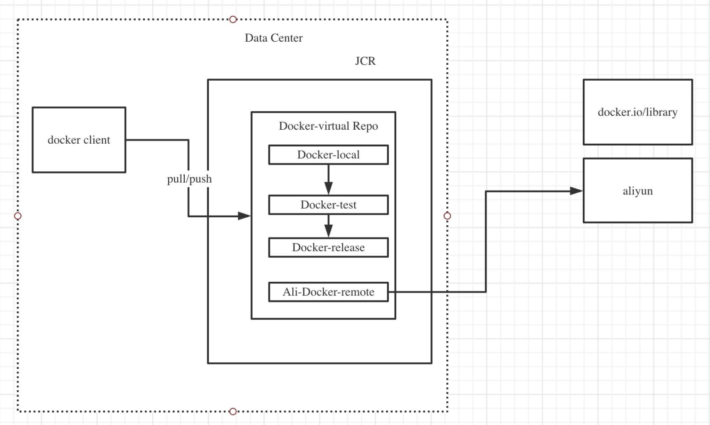

# kubernetes之容器镜像中心

## 深入理解容器镜像中心

-    Dockerhub介绍 https://registry.hub.docker.com/
-    配置国内 Docker 镜像源

```bash
vi  /etc/docker/daemon.json
#修改后如下：
{
    "registry-mirrors": ["https://registry.docker-cn.com"],
    "live-restore": true
}
```

-    重启 docker 服务

```bash
systemctl restart docker
```

-    推送镜像到 dockerhub

```bash
docker login
Login with your Docker ID to push and pull images from Docker Hub. If you don't have a Docker ID, head over to https://hub.docker.com to create one.
Username: wangqingjiewa
Password:

Login Succeeded

docker tag kubeblog:1.0 wangqingjiewa/kubeblog:1.0
[root@localhost Final]# docker push wangqingjiewa/kubeblog:1.0
```

## 实践搭建私有镜像中心

### 安装 JFrog Container Registry(JCR)

在 Master 节点上执行

#### 创建目录

```bash
mkdir ~/JFROG_HOME/
```

`vi ~/.bash_protile`，增加 JFROGL HOME 环境变量

```bash
export JFROG_HOME=~/JFROG_HOME
```

再执行` source ~/.bash profile`

```bash
mkdir -p $JFROG_HOME/artifactory/var/etc/ 
cd $JFROG_ HOME/artifactory/var/etc/ 
touch ./system.yaml
chmod -R 777 $JFROG HOME/artifactory/var
```

#### 下载镜像

```bash
docker pull releases-docker.jfrog.io/jfrog/artifactory-jcr:7.33.9
```

#### 启动JCR

```bash
docker run --name artifactory-jcr -v $JFROG_HOME/artifactory/var/:/var/opt/jfrog/artifactory -d -p 8081:8081 -p 8082:8082 releases-docker.jfrog.io/jfrog/artifactory-jcr:7.33.9
```

如果启动失败，可以清空挂在目录，执行

```bash
mkdir -p /artifactory/var/etc/
cd /artifactory/var/etc/
touch ./system.yaml
chown -R 1030:1030 /artifactory/var

docker run --name artifactory-jcr -v /artifactory/var/:/var/opt/jfrog/artifactory -d -p 8081:8081 -p 8082:8082 releases-docker.jfrog.io/jfrog/artifactory-jcr:latest
```

### 配置私有镜像中心

在Master, node 节点上分别配置JCR 的本地域名解析

```bash
vi /etc/hosts
192.168.99.101 master art.local
192.168.99.102 node1
192.168.99.103 node2
```

其中art.local 为 JFrog Container Registry 的服务地址。

配置Docker insecure registry `vi /etc/docker/daemon.json`

```
{
"registry-mirrors": ["https://registry.docker-cn.com",
"https://dockerhub.azk8s.cn",
"https://reg-mirror.qiniu.com",
"http://hub-mirror.c.163.com",
"https://docker.mirrors.ustc.edu.cn"
],
"insecure-registries": ["art.local:8081"]
}
```

systemctl restart docker

-    在页面上初始化JCR
-    执行 docker login

```bash
[root@master Chapter6]# docker login art.local:8081
Username: admin
Password:
WARNING! Your password will be stored unencrypted in /root/.docker/config.json.
Configure a credential helper to remove this warning. See
https://docs.docker.com/engine/reference/commandline/login/#credentials-store

Login Succeeded
```

配置JCR仓库

登录JCR 并创建5个仓库, 分别创建：docker-local, docker-test, docker-release, docker-remote 和 docker virtual 仓库



### 镜像推送到私有镜像中心

登录镜像中心，并上传镜像

```bash
docker login art.local:8081 admin/passw0rd
```

```bash
docker tag registry.cn-beijing.aliyuncs.com/qingfeng666/kubeblog:1.0 art.local:8081/docker-local/kubeblog:1.0
```

```bash
docker push art.local:8081/docker-local/kubeblog:1.0
```

登录 JCR 查看推送的镜像