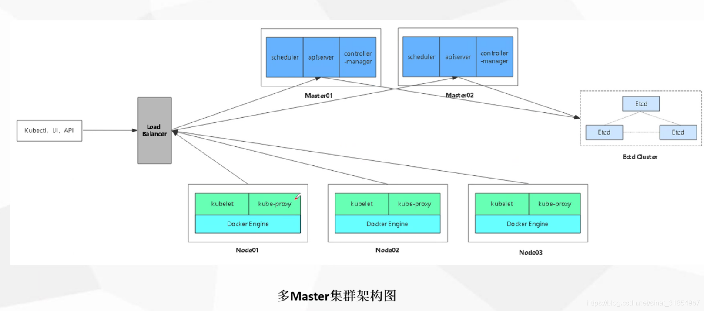

- [Kubernetes简介](#Kubernetes简介)
- [Kubernetes特性](#Kubernetes特性)
- [Kubernetes架构与组件](#Kubernetes架构与组件)
  - [Master组件](#Master组件)
  - [Node组件](#Node组件)
- [Kubernetes核心概念](#Kubernetes核心概念)
  - [Master](#Master)
  - [Node](#Node)
  - [Pod](#Pod)
  - [Controllers](#Controllers)
  - [Service](#Service)
  - [Label](#Label)
  - [Namespace](#Namespace)
  - [Annotation](#Annotation)
  - [Volume](#Volume)
  - [RC](#RC)
  - [HPA](#HPA)
- [kubernetes用途](#kubernetes用途)

------

## Kubernetes简介

[Kubernetes](https://kubernetes.io/)是Google的开源产品。

Kubernetes，也叫K8s。之所以叫K8s是因为Kubernetes这个单词从开头的字母K到末尾的s，中间刚好有8个字母，所以也叫K8s。

Kubernetes这个词在希腊语是“舵手”的意思，有意思的是Docker把自己比做鲸鱼，Google就把他们的产品起名叫舵手，我理解Google可能是想通过Kubernetes去操控Docker这个鲸鱼的意思。

Kubernetes（K8s）是一个开源系统，用于自动化容器化应用程序的部署，扩展和管理。它将组成应用程序的容器分组为逻辑单元，以便于管理和发现。Kubernetes拥有15年在Google上运行生产工作负载的经验，并结合了社区中最好的想法和实践。

## Kubernetes特性

-    易学：轻量级，简单，容易理解
-    便携：支持公有云，私有云，混合云，以及多种云平台
-    可扩展：模块化，可插拔，支持钩子，可任意组合
-    自修复：自动重调度，自动重启，自动复制

## Kubernetes架构与组件

-    架构示意图

     

生产环境一个Pod建议只放一个container

### Master组件

-    kube-apiserver

     Kubernetes API，集群统一入口，各组件协调者，以RESTful API提供接口服务，所有对象的资源的增删改查和监听操作都交给APIServer处理后在提交给Etcd存储。

-    kube-controller-manager

     处理集群中常规的后台任务，一个资源对应一个控制器，而ControllerManager就是负责管理这些控制器的

-    kube-scheduler

     根据调度算法为新创建的Pod选择一个node节点，可以部署在同一个节点上，也可以部署在不同节点上。

-    etcd

     分布式键值存储系统，用于保存群集状态数据，比如Pod、service等对象信息。

### Node组件

-    kubelet

     kubelet是Master在Node节点上的Agent，管理本机运行容器的生命周期，比如创建容器、Pod挂载数据卷、下载Secret、获取容器节点状态工作。kubelet将每个Pod转换成一组容器。

-    kube-proxy

     在node节点上实现Pod网络代理，维护网络规则和四层负载均衡工作

-    docker或rocket

     容器引擎，运行容器。

## Kubernetes核心概念

### Master

master指的是集群控制节点，来负责整个集群的管理和控制，基本上k8s的所有控制命令都是发给它。我们后面执行的命令基本都是在master节点上运行的。通常它会占据一个独立的x86服务器（或一个虚拟机）

### Node

k8s集群中其他机器被称为node节点，Node可以是一台物理机，也可以是一台虚拟机。当某个node宕机，其上的工作负载会被master自动转移到其他节点上。

### Pod

-    最小部署单元
-    一组容器的集合
-    一个Pod中的容器共享网络命名空间
-    Pod是短暂的

### Controllers

-    RelicaSet：确保预期的Pod副本数量
-    Deployment：无状态应用部署
-    StatefulSet：有状态应用部署
-    DaemonSet：确保node运行同一个Pod
-    Job：一次性任务
-    Cronjob：定时任务

### Service

-    防止Pod失联
-    定义一组Pod访问策略

### Label

标签，附加到某个资源上，用于关联对象、查询和筛选

### Namespace

命名空间，将对象逻辑上隔离

### Annotation

注释

### Volume

存储卷

### RC

-    确保Pod数量: 它会确保Kubernetes中有指定数量的Pod在运行，如果少于指定数量的Pod，RC就会创建新的，反之会删除多余的，保证Pod的副本数量不变
-    确保Pod健康: 当Pod不健康，RC会杀死不健康的Pod，重新创建新的
-    弹性伸缩: 在业务高峰或者低峰的时候，可以用RC来动态调整Pod数量来提供资源的利用率吧，当然也可以使用HPA来实现
-    滚动升级: 滚动升级是一种平滑的升级方式，通过逐步替换的策略，保证整体系统的稳定性

### HPA

（horizontal Pod Autoscaler）：Pod自动弹性伸缩，K8S通过对Pod中运行的容器各项指标（CPU占用、内存占用、网络请求量）的检测，实现对Pod实例个数的动态新增和减少

## kubernetes用途

在您生产环境中使用 Kubernetes 的主要优势在于，它提供了一个便捷有效的平台，让您可以在物理机和虚拟机集群上调度和运行容器。更广泛一点说，它可以帮助您在生产环境中，完全实施并依托基于容器的基础架构运营。由于 Kubernetes 的实质在于实现操作任务自动化，所以您可以将其它应用平台或管理系统分配给您的许多相同任务交给容器来执行。

利用 Kubernetes，您能够达成以下目标：

-    跨多台主机进行容器编排。
-    更加充分地利用硬件，最大程度获取运行企业应用所需的资源。
-    有效管控应用部署和更新，并实现自动化操作。
-    挂载和增加存储，用于运行有状态的应用。
-    快速、按需扩展容器化应用及其资源。
-    对服务进行声明式管理，保证所部署的应用始终按照部署的方式运行。
-    利用自动布局、自动重启、自动复制以及自动扩展功能，对应用实施状况检查和自我修复。

但是，Kubernetes 需要依赖其它项目来全面提供这些经过编排的服务。因此，借助其它开源项目可以帮助您将 Kubernetes 的全部功能发挥出来。这些功能包括：

-    注册表，通过 Atomic 注册表或 Docker 注册表等项目实现。
-    联网，通过 OpenvSwitch 和智能边缘路由等项目实现。
-    遥测，通过 heapster、kibana、hawkular 和 elastic 等项目实现。
-    安全性，通过 LDAP、SELinux、RBAC 和 OAUTH 等项目以及多租户层来实现。
-    自动化，参照 Ansible 手册进行安装和集群生命周期管理。
-    服务，可通过自带预建版常用应用模式的丰富内容目录来提供。
